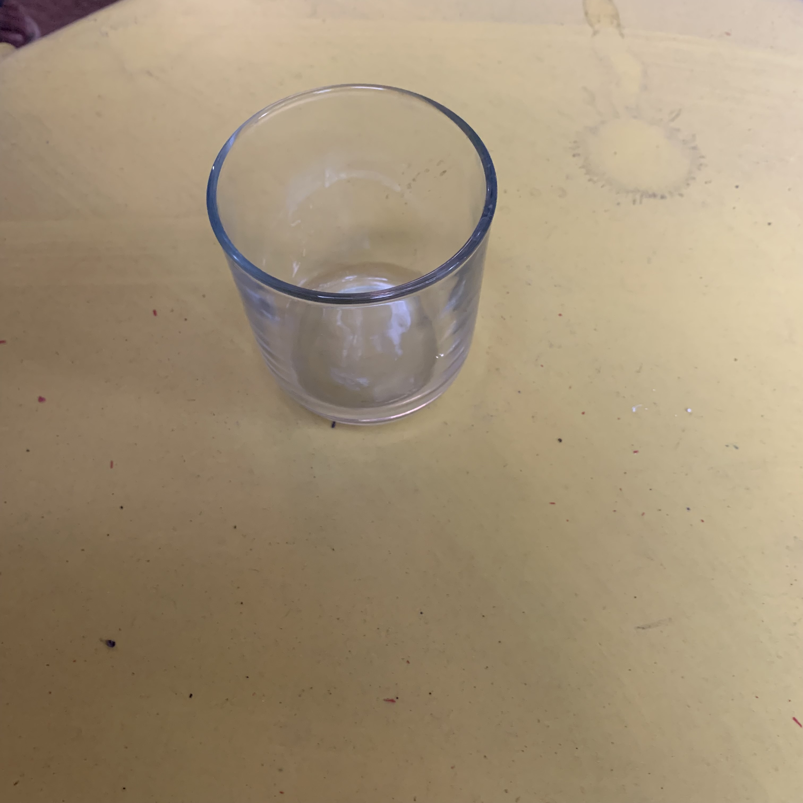
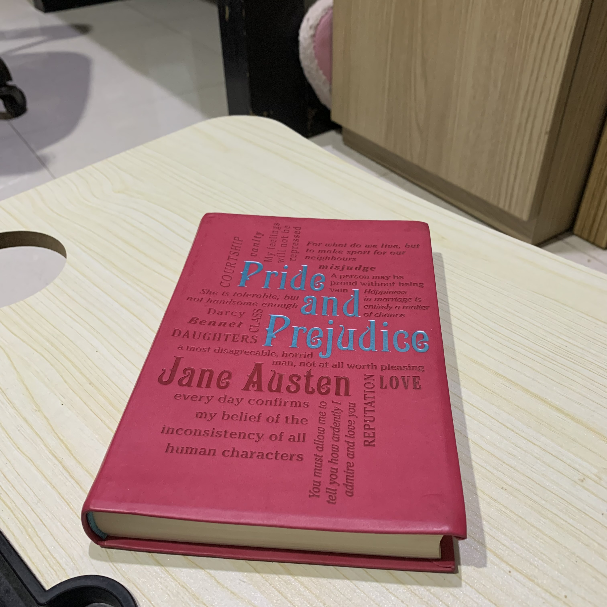
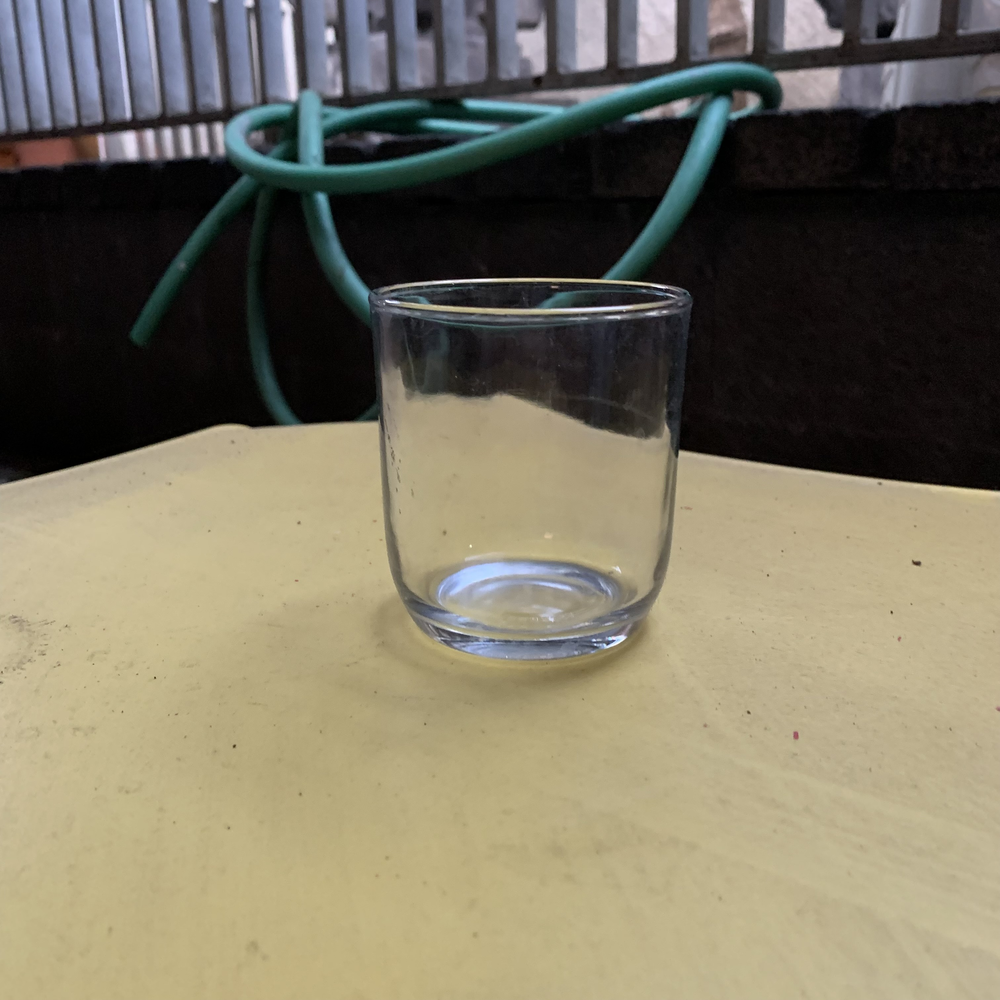
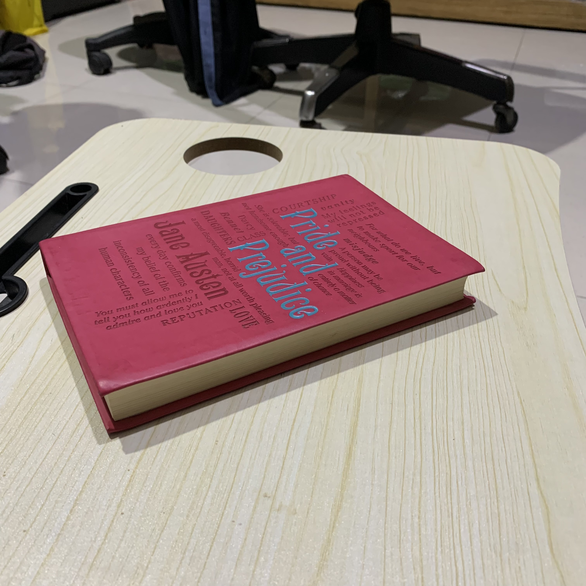

# tugas-1-dydyandra
tugas-1-dydyandra created by GitHub Classroom

**Nama**: Dyandra Paramitha Widyadhana 
**NRP**: 05111940000119

## Penugasan 0
1. Cari benda di sekitar Anda yang berawalan huruf B, G, atau L.
2. Letakkan benda tersebut di atas permukaan datar: meja, lantai, dsb.
3. Ambil foto benda tersebut dari empat sudut pandang yang berbeda: kanan atas, kiri atas, belakang atas, depan atas (sudut kemiringan bebas).

## Penugasan 1
1. Membuat sebuah aplikasi Grafika berbasis WebGL pada repo tugas
2. Hasil tugas dapat dilihat di [Link Tugas](https://cg2021b.github.io/tugas-1-dydyandra/)

## Penugasan 2
1. Membuat dan menampilkan beberapa geometri dan diberi animasi, beberapa obyek ditampilkan wireframe
2. Menggunakan beberapa jenis material 
3. Menggunakan beberapa jenis lighting (AmbientLight, HemisphereLight, DirectionalLight, PointLight, Spotlights)
Hasil tugas dapat dilihat di [Link Tugas](https://cg2021b.github.io/tugas-1-dydyandra/mencoba%20three%20js/)

### Benda yang Digunakan: Gelas

### Foto dari Belakang Atas

### Foto dari Depan Atas

### Foto dari Kiri 

### Foto dari Kanan 

