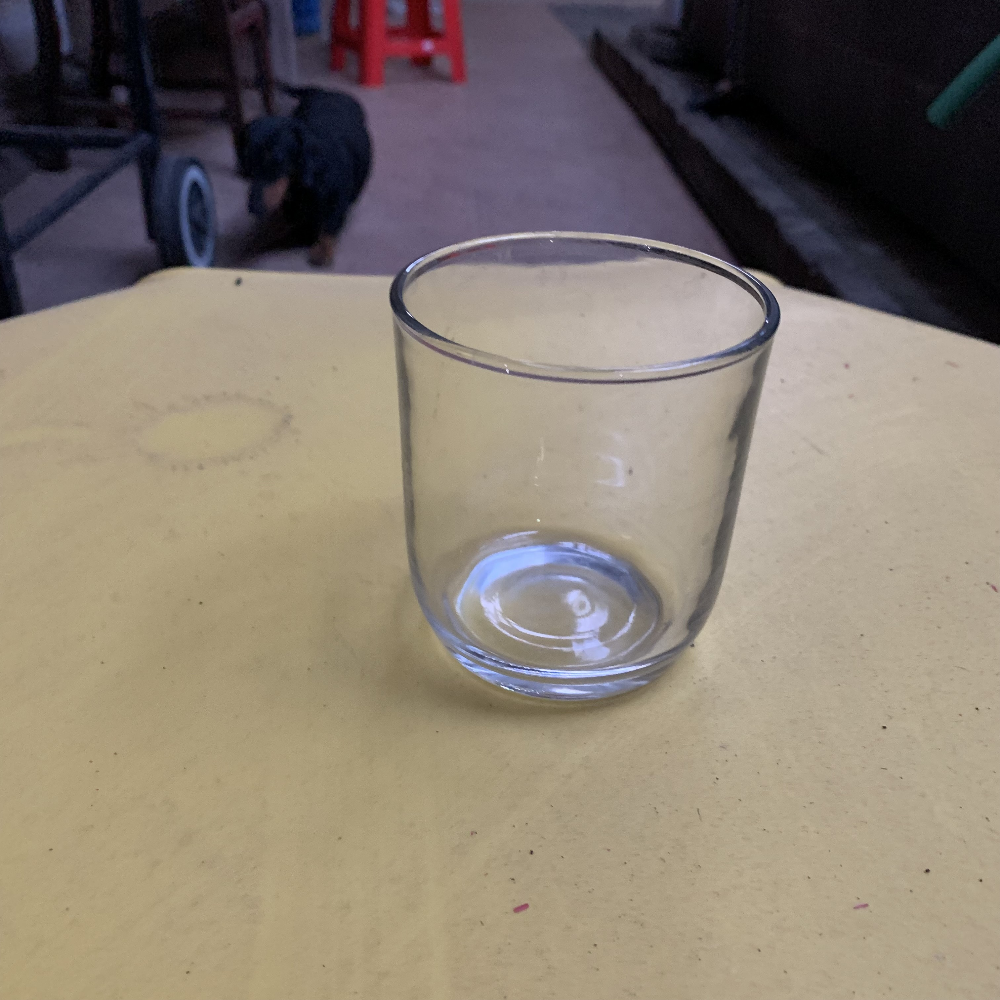
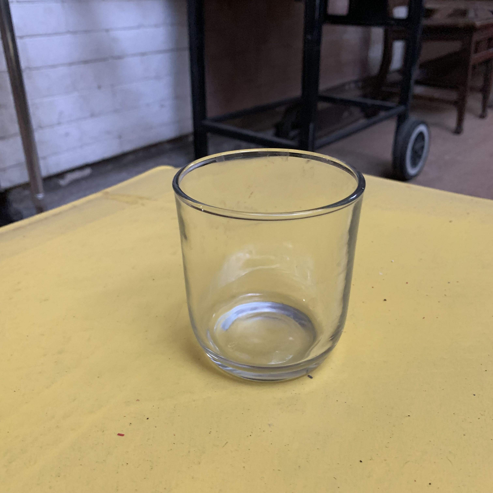

# tugas-1-dydyandra
tugas-1-dydyandra created by GitHub Classroom

**Nama**: Dyandra Paramitha Widyadhana 
**NRP**: 05111940000119

## Penugasan
1. Cari benda di sekitar Anda yang berawalan huruf B, G, atau L.
2. Letakkan benda tersebut di atas permukaan datar: meja, lantai, dsb.
3. Ambil foto benda tersebut dari empat sudut pandang yang berbeda: kanan atas, kiri atas, belakang atas, depan atas (sudut kemiringan bebas).

### Benda yang Digunakan: Buku Flexibound

### Foto dari Belakang Atas

### Foto dari Depan Atas

### Foto dari Kiri Atas

### Foto dari Kanan Atas

